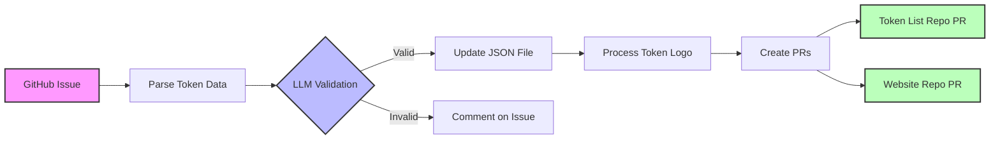

# Automated Token Listing Request Automation PRD

## Table of Contents
1. [Overview](#1-overview)
2. [Goals and Objectives](#2-goals-and-objectives) 
3. [Scope](#3-scope)
4. [Implementation Plan](#4-implementation-plan)
5. [Testing Plan](#5-testing-plan)
6. [Final Considerations](#6-final-considerations)
7. [Getting Started](#7-getting-started)

## 1. Overview

This solution automates the process of handling token listing requests submitted via GitHub Issues. It leverages an LLM to verify token details and uses GitHub Actions to update two repositories: the token list (e.g., `evm-token-list`) and a website repository (`sablier-labs.github.io`). The process minimizes manual intervention while ensuring security, reliability, and maintainability.



---

## 2. Goals and Objectives

- **Automation:**  
  Convert user-submitted GitHub issues into validated pull requests for token listings.

- **Verification:**  
  Use LLM-powered validation to ensure token details (address, decimals, symbol, token icon, etc.) are correct.

- **Repository Updates:**  
  Update the token JSON file and add token logos across two repositories automatically.

- **Safety & Maintainability:**  
  Implement robust error handling, logging, rate limiting, and security practices to ensure a stable, secure, and scalable solution.

---

## 3. Scope

### Functional Requirements

- **Issue Submission Template:**  
  Users must submit GitHub Issues following a strict template with required fields:  
  - **Token Address** (must be checksummed - formatted with correct capitalization per EIP-55)  
  - **Token Name** (from contract)  
  - **Token Decimals** (from contract)  
  - **Token Symbol** (from contract)  
  - **Token Icon** (PNG under 200×200 pixels)  
  - **Chain**  
  - **Official Project Link**  
  - **CoinGecko/CoinMarketCap Token Page**

  Example template:
  ```markdown
  ## Token Information
  - Token Address: 0xA0b86991c6218b36c1d19D4a2e9Eb0cE3606eB48
  - Token Name: USD Coin
  - Token Decimals: 6
  - Token Symbol: USDC
  - Token Icon URL: https://example.com/usdc-logo.png
  - Chain: Ethereum
  - Official Project Link: https://www.circle.com/
  - CoinGecko/CoinMarketCap: https://www.coingecko.com/en/coins/usd-coin
  ```

- **Data Parsing & Validation:**  
  - Parse the issue title (format: `Add {TOKEN_SYMBOL}: {TOKEN_NAME}`) and body to extract fields using LLM.
  - Verify token details by sending a prompt to an LLM which responds with "valid" or "invalid." and any comments.

- **Token List Update:**  
  - Find relevant json file in the token list repository.
  - Append new token objects to the JSON file.
  - Prevent duplicate token entries by checking the token address.

  Example JSON structure:
  ```json
  {
    "name": "USD Coin",
    "address": "0xA0b86991c6218b36c1d19D4a2e9Eb0cE3606eB48",
    "symbol": "USDC",
    "decimals": 6,
    "chainId": 1,
    "logoURI": "https://raw.githubusercontent.com/sablier-labs/sablier-labs.github.io/main/images/tokens/0xA0b86991c6218b36c1d19D4a2e9Eb0cE3606eB48.png"
  }
  ```

- **Token Logo Processing:**  
  - Download the token icon from the provided URL.
  - Validate that the icon is a PNG and does not exceed 200×200 pixels.
  - Save the image locally for later use in the website repository update.

- **Automated PR Creation:**  
  - Commit changes (JSON updates and token logo) and create pull requests (PRs) in both the evm-token-list and sablier-labs.github.io repositories.
  - Initially disable auto-merge to allow manual verification until the process is confirmed to be stable.

- **Trigger Mechanism:**  
  - Trigger on new issue events.
  - Also run on a schedule (every 12 hours) to check for unprocessed issues.

### Non-Functional Requirements

- **Error Handling & Rollback:**  
  - Implement error handling in both the Python script and workflows.
  - Introduce notifications or rollback mechanisms when failures occur (e.g., during JSON updates or image processing).

- **Logging & Monitoring:**  
  - Detailed logging for each step (parsing, LLM validation, file updates) to assist troubleshooting.
  - Consider integration with monitoring tools to alert on repeated failures.

- **Security & Secrets Management:**  
  - Securely store API keys (e.g., `OPENAI_API_KEY`) and GitHub tokens as secrets.
  - Validate all external inputs to avoid injection attacks.

- **Rate Limiting & API Quotas:**  
  - Account for API rate limits (for both OpenAI and GitHub).
  - Implement retry logic for transient errors.

- **Performance & Scalability:**  
  - Ensure the system scales gracefully as token listing requests increase.
  - Use caching or batching strategies if required.

- **Documentation & Maintenance:**  
  - Provide clear documentation on how to update workflows, scripts, and dependency management.
  - Keep the process adaptable for future modifications (e.g., changes to token requirements).

---

## 4. Implementation Plan

### 4.1. Development Phases

1. **Design & Specification:**
   - Finalize the token submission template and required fields.
   - Define the validation criteria for the LLM prompt.

2. **Python Script Development (`process_token_issue.py`):**
   - **Parsing Module:**  
     - Parse issue title and body using LLM.
     
   - **LLM Verification Module:**  
     - Formulate a prompt to verify token details.
     - Handle both "valid" and "invalid" responses.
     ```python
     # Sample LLM prompt structure
     prompt = f"""
     Verify the following token details:
     Token Address: {address}
     Token Name: {name}
     Token Decimals: {decimals}
     Token Symbol: {symbol}
     Chain: {chain}
     
     Respond with 'valid' if all details match on-chain data, otherwise 'invalid'.
     """
     ```
   - **JSON Handling:**  
     - Read, update, and write to the JSON file.
     - Check for duplicate token addresses.
   - **Token Icon Processing:**  
     - Download and validate the token logo (format and size).
     - Save the file locally.
   - **Error Handling:**  
     - Implement try/catch blocks with descriptive logging.
     - Exit gracefully or trigger a rollback if a step fails.

3. **GitHub Actions Workflow Setup (`.github/workflows/auto-token-listing.yml`):**
   - **Job: process-token-issue**
     - Trigger on issue creation and scheduled events.
     - Checkout repository, set up Python, and install dependencies (from `requirements.txt`).
     - Execute the Python script and commit the changes.
     - Create a PR using actions such as [peter-evans/create-pull-request](https://github.com/peter-evans/create-pull-request).
     - Upload token logo as an artifact.
   - **Job: update-token-logo**
     - Download the token logo artifact.
     - Checkout the sablier-labs.github.io repository.
     - Copy the token logo into the proper folder and create a PR.
   - **Environment Variables & Secrets:**
     - Set up environment variables for `ISSUE_TITLE`, `ISSUE_BODY`, and `OPENAI_API_KEY`.
     - Configure GitHub secrets for secure API token management.

4. **Dependency Management:**
   - Use a `requirements.txt` file with:
     ```
     openai
     requests
     Pillow
     ```

---

## 5. Testing Plan

### 5.1. Unit Testing

- **Python Script Components:**
  - Test parsing functions with multiple sample inputs to ensure accurate extraction.
  - Simulate LLM responses (both "valid" and "invalid") using mocks.
  - Validate JSON update logic including duplicate detection.
  - Test image download and validation functions with various image sizes and formats.

### 5.2. Integration Testing

- **Local Simulation:**
  - Use tools like [Act](https://github.com/nektos/act) to simulate GitHub Actions locally.
  - Run the complete workflow in a test repository or fork to verify end-to-end processing.

- **Artifact & PR Verification:**
  - Ensure the token logo artifact is correctly passed between jobs.
  - Confirm that pull requests in both repositories are created with the expected changes.

### 5.3. End-to-End Testing

- **Staging Environment:**
  - Deploy the workflow in a dedicated test repository.
  - Simulate GitHub Issue submissions and track processing, verification, and PR generation.
  - Verify branch protection and manual merge steps are properly enforced.

### 5.4. Monitoring & Debugging

- **Logging:**  
  - Review detailed logs from GitHub Actions to identify any failures.
  - Use environment variables like `ACTIONS_RUNNER_DEBUG` for enhanced debug output.
- **Alerts:**  
  - Integrate alerting (e.g., via email or Slack) for repeated workflow failures or critical errors.

---

## 6. Final Considerations

- **Rollback & Notifications:**  
  Implement a rollback mechanism or error notifications for any failed step to prevent corrupt data updates.
  
- **Future Enhancements:**  
  - Enhance the LLM prompt for more granular feedback.
  - Consider auto-merge options once the workflow is proven reliable.
  - Expand monitoring to include metrics on processing times and error rates.
